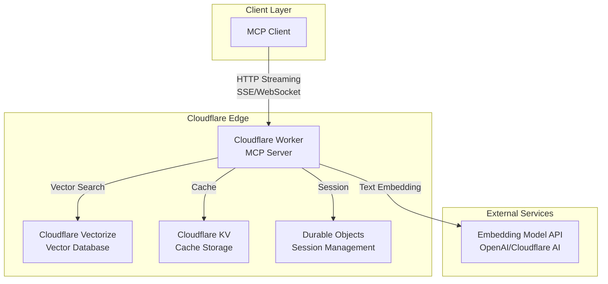
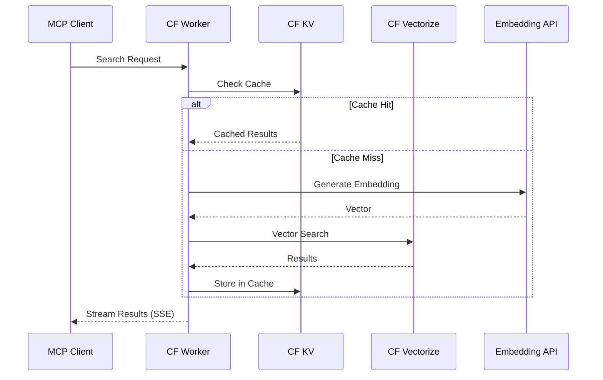
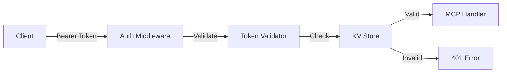

# 技術設計書

## 概要
本設計書は、Cloudflare Worker上で動作するRemote MCP ServerをStreamable HTTP Transportで実装するための技術仕様を定義する。このサーバーはCloudflare Vectorizeを使用したRAGシステムと統合し、MCPプロトコルに準拠した検索機能を提供する。

## アーキテクチャ



## 技術スタック

- **サーバー環境**: Cloudflare Workers (V8 Isolate)
- **プログラミング言語**: TypeScript
- **MCPフレームワーク**: @modelcontextprotocol/sdk
- **HTTPトランスポート**: Server-Sent Events (SSE) / HTTP Streaming
- **ベクトルデータベース**: Cloudflare Vectorize
- **キャッシュ**: Cloudflare KV
- **セッション管理**: Cloudflare Durable Objects
- **認証**: Bearer Token / API Key
- **ビルドツール**: Wrangler CLI
- **テスト**: Vitest + Miniflare

## コンポーネントとインターフェース

### 1. MCPサーバーコア
```typescript
// src/server/MCPServer.ts
export class MCPServer {
  constructor(
    private readonly vectorizeClient: VectorizeClient,
    private readonly embeddingService: EmbeddingService,
    private readonly cache: CacheService
  ) {}

  // MCP標準メソッド
  async handleInitialize(params: InitializeParams): Promise<InitializeResult>
  async handleListTools(): Promise<ListToolsResult>
  async handleCallTool(params: CallToolParams): Promise<CallToolResult>
  async handleListResources(): Promise<ListResourcesResult>
  async handleReadResource(params: ReadResourceParams): Promise<ReadResourceResult>
}
```

### 2. HTTPトランスポート層
```typescript
// src/transport/StreamableHTTPTransport.ts
export class StreamableHTTPTransport {
  async handleRequest(request: Request): Promise<Response> {
    if (request.headers.get('Accept') === 'text/event-stream') {
      return this.handleSSE(request);
    }
    return this.handleJSONRPC(request);
  }

  private async handleSSE(request: Request): Promise<Response>
  private async handleJSONRPC(request: Request): Promise<Response>
}
```

### APIエンドポイント
```
POST /mcp - MCP JSON-RPCエンドポイント
GET /mcp/stream - SSEストリーミングエンドポイント
GET /health - ヘルスチェック
GET /mcp/info - サーバー情報
```

### データフロー



## データモデル

### MCPツール定義
```typescript
interface SearchTool {
  name: "search";
  description: "Cloudflare Vectorizeに構築されたRAGシステムを検索";
  inputSchema: {
    type: "object";
    properties: {
      query: {
        type: "string";
        description: "検索クエリ";
      };
      indexName: {
        type: "string";
        description: "Vectorizeインデックス名";
        default: "default-index";
      };
      topK: {
        type: "number";
        description: "返す結果の最大数";
        default: 10;
      };
      threshold: {
        type: "number";
        description: "関連性スコアのしきい値";
        default: 0.7;
      };
    };
    required: ["query"];
  };
}
```

### 検索結果モデル
```typescript
interface SearchResult {
  id: string;
  content: string;
  metadata: Record<string, any>;
  score: number;
  highlights?: string[];
}

interface SearchResponse {
  results: SearchResult[];
  totalCount: number;
  queryEmbedding?: number[];
  processingTime: number;
}
```

### Vectorizeメタデータスキーマ
```typescript
interface VectorizeMetadata {
  documentId: string;
  content: string;
  title?: string;
  source?: string;
  createdAt: string;
  tags?: string[];
  [key: string]: any;
}
```

## エラーハンドリング

### エラー分類とレスポンス
```typescript
enum ErrorCode {
  INVALID_REQUEST = -32600,
  METHOD_NOT_FOUND = -32601,
  INVALID_PARAMS = -32602,
  INTERNAL_ERROR = -32603,
  
  // カスタムエラー
  VECTORIZE_ERROR = -32001,
  EMBEDDING_ERROR = -32002,
  RATE_LIMIT_ERROR = -32003,
  AUTH_ERROR = -32004,
}

class MCPError extends Error {
  constructor(
    public code: ErrorCode,
    public message: string,
    public data?: any
  ) {
    super(message);
  }
}
```

### リトライ戦略
```typescript
class RetryableOperation {
  async execute<T>(
    operation: () => Promise<T>,
    options: {
      maxRetries: number;
      backoffMs: number;
      maxBackoffMs: number;
    }
  ): Promise<T>
}
```

## セキュリティ考慮事項

### 認証フロー


### セキュリティ実装
```typescript
// src/middleware/auth.ts
export class AuthMiddleware {
  async authenticate(request: Request): Promise<AuthContext> {
    const token = this.extractToken(request);
    if (!token) throw new MCPError(ErrorCode.AUTH_ERROR, "Missing token");
    
    const isValid = await this.validateToken(token);
    if (!isValid) throw new MCPError(ErrorCode.AUTH_ERROR, "Invalid token");
    
    return this.createAuthContext(token);
  }
}

// Rate Limiting
export class RateLimiter {
  constructor(
    private readonly storage: DurableObjectNamespace,
    private readonly limits: RateLimitConfig
  ) {}
  
  async checkLimit(key: string): Promise<boolean>
}
```

## パフォーマンスとスケーラビリティ

### キャッシング戦略
```typescript
interface CacheStrategy {
  // クエリベースのキャッシュキー生成
  generateKey(query: string, params: SearchParams): string;
  
  // TTL設定
  getTTL(resultCount: number): number;
  
  // キャッシュ無効化
  invalidate(pattern: string): Promise<void>;
}
```

### 最適化手法
1. **ベクトル検索の最適化**
   - インデックスの事前ウォーミング
   - 適切なベクトル次元数の選択
   - バッチ処理の実装

2. **ストリーミング最適化**
   - チャンクサイズの調整
   - バックプレッシャー制御
   - 接続タイムアウト管理

3. **リソース管理**
   - Worker CPUタイム制限への対応
   - メモリ使用量の監視
   - 同時接続数の制限

## テスト戦略

### ユニットテスト
```typescript
// tests/unit/MCPServer.test.ts
describe('MCPServer', () => {
  it('should handle search tool call', async () => {
    const mockVectorize = createMockVectorizeClient();
    const server = new MCPServer(mockVectorize, ...);
    
    const result = await server.handleCallTool({
      name: 'search',
      arguments: { query: 'test query' }
    });
    
    expect(result).toMatchObject({
      content: expect.arrayContaining([
        expect.objectContaining({
          type: 'text',
          text: expect.stringContaining('results')
        })
      ])
    });
  });
});
```

### 統合テスト
```typescript
// tests/integration/streaming.test.ts
describe('Streaming Transport', () => {
  it('should stream search results via SSE', async () => {
    const response = await fetch('/mcp/stream', {
      method: 'POST',
      headers: { 'Accept': 'text/event-stream' },
      body: JSON.stringify({
        method: 'tools/call',
        params: { name: 'search', arguments: { query: 'test' } }
      })
    });
    
    const reader = response.body.getReader();
    const events = await readSSEEvents(reader);
    
    expect(events).toContainEqual(
      expect.objectContaining({
        event: 'result',
        data: expect.any(String)
      })
    );
  });
});
```

### E2Eテスト
```typescript
// tests/e2e/search-flow.test.ts
describe('E2E Search Flow', () => {
  it('should complete full search workflow', async () => {
    // 1. 認証
    // 2. 検索実行
    // 3. 結果の検証
    // 4. キャッシュ動作の確認
  });
});
```